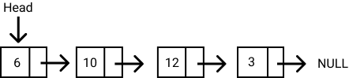

# Data Structures in Javascript - Linked List

A **linked list** is a linear data structure similar to an array. However, unlike arrays, elements are not stored in a particular memory location or index. Rather each element is a separate object that contains a pointer or a link to the next object in that list.
 
Each element (commonly called nodes) contains two items: the data stored and a link to the next node. The data can be any valid data type. You can see this illustrated in the diagram below.

  
Check out [this YouTube video][videoUrl], where we implemented the Stack.

## Run the script

In order to run this you need to clone the repository and run `node linked_list.js` in this folder.

[videoUrl]: https://youtu.be/4JTc3DQbbRo
